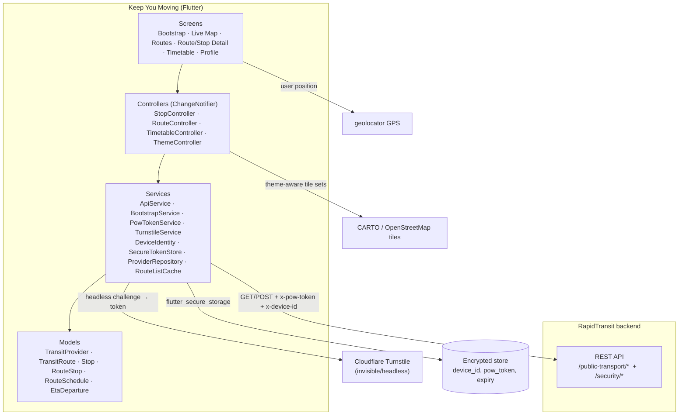

# Keep You Moving

Keep You Moving is a Flutter mobile application developed as an assignment for 
**BMIT2073 Mobile Application Development**. The application focuses on 
real-time bus tracking and public transport information in Kuala Lumpur, Malaysia.
It helps riders find nearby stops, browse bus routes, see live vehicle positions 
on a map, and check real-time departure estimates (ETAs) — with a focus on a clean, 
high-fidelity user experience.

Transit data is sourced from the
[data.gov.my](https://api.data.gov.my/gtfs-static) open-data GTFS feeds.


---

## 📋 Table of Contents

- [Features](#features)
- [Tech Stack](#tech-stack)
- [Architecture](#architecture)
- [Project Structure](#project-structure)
- [Requirements](#requirements)
- [Installation](#installation)
- [Configuration](#configuration)
- [Running](#running)
- [Building](#building)
- [API](#api)
- [Permissions](#permissions)
- [Security](#security)
- [Troubleshooting](#troubleshooting)
- [Development](#development)
- [Contributing](#contributing)

---

## Features

### Implemented

- **Track buses around you** — See your current location on the map and find nearby bus stops without having to search for them manually.
- **Choose your transport service** — Switch between Rapid KL Bus and Rapid KL MRT Feeder services, with each service having its own visual identity.
- **Find the route you need** — Browse available routes or search for a specific route to quickly find the one you're looking for.
- **See the full route** — Open a route to view its stops in order and switch between different directions of travel.
- **Check buses in real time** — View buses currently operating along a route, including their location, speed and vehicle plate number where available.
- **Know when your bus is coming** — Check upcoming departures and live ETA information for a selected stop, with information refreshed automatically.
- **View routes directly on the map** — See the route path, bus stops and active buses together on the map to get a better idea of where your bus is.
- **Check the timetable** — Look up scheduled departures by service, route and stop, including operating days and expected intervals between buses.
- **Open timetables directly** — Jump straight to a specific stop or route's timetable instead of navigating through the entire timetable menu.
- **Light and dark mode** — Choose between light mode, dark mode or follow your device's system setting.
- **Responsive interface** — The layout adapts to different screen sizes, using bottom navigation on phones and a navigation rail on larger screens.
- **Protected API access** — The app performs a secure verification process before accessing the public transport services.

### Planned / not yet implemented

- Saving favorite stops and routes (the Profile screen shows a placeholder:
  "Saving favorites is coming soon").
- The bundled `providers.json` lists 15 transit providers, but the app UI
  currently exposes only the two "dev" providers (Rapid KL Bus and MRT Feeder).

## Tech Stack

| Area | Technology |
| --- | --- |
| Language | Dart |
| UI framework | Flutter |
| Maps | OpenStreetMap |
| Location | Geolocator |
| Security / auth | Cloudflare Turnstile + Google OAuth |
| Backend | KeepYouMoving backend REST API serving GTFS static + real-time data (see [API](#api)) |

> The app has no local database and no state-management package (Provider,
> Riverpod, Bloc, etc.). All state lives in `ChangeNotifier`/`ValueNotifier`
> controllers; caching is in-memory only.

## Architecture

The app follows a simple layered design: **screens** are thin compositors that
render state, **controllers** (`ChangeNotifier`) hold UI state and orchestrate
data loads, and **services** wrap networking, security, and caching. Models are
plain Dart classes with defensive JSON parsing.

Startup is gated by a **bootstrap** flow: before the Home screen is shown, the
app generates/persists a device ID, obtains a Cloudflare Turnstile token
(headless), exchanges it for a device-bound proof-of-work (PoW) token, and only
then configures the authenticated API client. Every transit request then carries
`x-pow-token` and `x-device-id` headers.



**Typical data flow:**

1. **Bootstrap (one-time per launch):** `DeviceIdentity` generates/persists a
   UUID device ID → `TurnstileService` runs the headless challenge →
   `PowTokenService` exchanges the Turnstile token at
   `POST /security/pow-token` → the PoW token (and its expiry) is stored in
   `flutter_secure_storage` and set on the shared `ApiService`.
2. **Transit data:** controllers call `ApiService.get/post` against
   `/public-transport/…` with the auth headers, parse the JSON envelope into
   models, and expose the result to the UI. Static route lists and provider
   metadata are cached in memory (`RouteListCache`, `ProviderRepository`);
   live ETA/vehicle positions are **never** cached.

## Project Structure

```
my_bus_tracker/
├── lib/
│   ├── main.dart                     # App entry; wires ThemeController + BootstrapService
│   ├── config/
│   │   ├── api_config.example.dart   # Template (committed) — copy to api_config.dart
│   │   └── api_config.dart           # Local config (git-ignored) — base URLs, Turnstile key
│   ├── controllers/                  # ChangeNotifier/ValueNotifier UI state
│   │   ├── stop_controller.dart      #   nearest stops + per-stop routes
│   │   ├── route_controller.dart     #   route stops, geometry, ETA departures
│   │   ├── timetable_controller.dart #   provider → route → stop → schedule chain
│   │   └── theme_controller.dart     #   app theme mode (session-only)
│   ├── models/                       # Plain Dart models with defensive JSON parsing
│   │   ├── transit_provider.dart
│   │   ├── transit_route.dart
│   │   ├── stop.dart
│   │   ├── route_stop.dart
│   │   ├── route_schedule.dart
│   │   └── eta_departure.dart        #   incl. LiveVehicle / VehiclePosition
│   ├── screens/                      # Thin screen compositors
│   │   ├── bootstrap_screen.dart     #   splash + progress + retry
│   │   ├── home_screen.dart          #   bottom nav / navigation rail shell
│   │   ├── live_map_screen.dart      #   map + nearest stops + search
│   │   ├── routes_screen.dart        #   searchable route list
│   │   ├── route_detail_screen.dart  #   stop timeline + direction toggle
│   │   ├── stop_detail_screen.dart   #   map, polyline, live buses, ETA
│   │   ├── timetable_screen.dart     #   static departure times
│   │   └── profile_screen.dart       #   theme picker + about
│   ├── services/                     # Networking, security, caching
│   │   ├── api_service.dart          #   HTTP client; attaches auth headers
│   │   ├── bootstrap_service.dart    #   launch orchestration (single-flight)
│   │   ├── pow_token_service.dart    #   PoW token lifecycle (reuse/refresh)
│   │   ├── turnstile_service.dart    #   headless Cloudflare Turnstile
│   │   ├── device_identity.dart      #   UUID v4 per install
│   │   ├── secure_token_store.dart   #   encrypted storage wrapper
│   │   ├── provider_repository.dart  #   reads assets/data/providers.json
│   │   └── route_list_cache.dart     #   in-memory per-provider route cache
│   ├── theme/
│   │   └── app_theme.dart            # Material 3 scheme, provider themes, typography
│   ├── utils/
│   │   ├── api_envelope.dart         # Envelope extraction helpers
│   │   └── format.dart               # Distance / speed / hex-color helpers
│   └── widgets/                      # Reusable UI pieces (map, sheets, stops, live bus)
├── assets/
│   ├── data/providers.json           # Bundled GTFS provider metadata (15 providers)
│   └── logo.png                      # App logo (placeholder — replace with final brand)
├── android/                          # Android host (see Requirements)
├── ios/                              # iOS host
├── web/                              # Web host
├── linux/ · macos/ · windows/        # Desktop hosts
└── pubspec.yaml
```

## Requirements

- **Flutter SDK** — recent stable (Dart `>=3.0.0 <4.0.0`; the lock file was
  resolved against Dart `>=3.11.0`).
- **Android** (primary target):
  - Android SDK with a recent `compileSdk`/`targetSdk` (Flutter-managed).
  - **minSdk 23** — required by `flutter_secure_storage` for the encrypted
    token store (see the note in `android/app/build.gradle.kts`).
  - **Java 17** toolchain (`sourceCompatibility`/`targetCompatibility` =
    `VERSION_17` in `android/app/build.gradle.kts`).
- **Internet connection** — the app requires the backend API and Cloudflare
  Turnstile at launch; it will not pass bootstrap offline.
- **Location services** — required for the live-map features (nearest stops and
  centering the map). The app degrades gracefully with an honest
  "location unavailable" status when permission is denied.
- A working backend at the configured base URL (see
  [Configuration](#configuration)). There is no mock/offline data mode.

## Installation

1. **Clone the repository**

   ```bash
   git clone <repository-url>
   cd my_bus_tracker
   ```

2. **Install Flutter dependencies**

   ```bash
   flutter pub get
   ```

3. **Configure the backend** (see [Configuration](#configuration))

   `lib/config/api_config.dart` is **git-ignored** because it can contain
   environment-specific values. On a fresh clone, create it from the committed
   template:

   ```bash
   cp lib/config/api_config.example.dart lib/config/api_config.dart
   ```

   Then open `lib/config/api_config.dart` and fill in the backend base URL and
   Turnstile site key. They are **not** read from environment variables, so if
   you point at a different backend you must edit this file and rebuild.

4. **Run the application**

   ```bash
   flutter run
   ```

   > `assets/logo.png` is a placeholder brand logo (used by the bootstrap
   > splash and launcher icons). Replace the file with the final logo using the
   > same filename, then regenerate launcher icons with
   > `dart run flutter_launcher_icons`.

## Configuration

All configuration lives in `lib/config/api_config.dart` as compile-time
constants. That file is **git-ignored**; the committed template is
`lib/config/api_config.example.dart`. On a fresh clone, create your local copy
and fill in the values:

```bash
cp lib/config/api_config.example.dart lib/config/api_config.dart
```

| Constant | Value to set | Purpose |
| --- | --- | --- |
| `prodBase` | `https://YOUR_BACKEND_HOST/prod/public` | Environment root for the backend |
| `publicTransportBase` | `$prodBase/public-transport/` | Prefix for every transit endpoint |
| `securityBase` | `$prodBase/security/` | Prefix for the PoW token exchange |
| `turnstileSiteKey` | `YOUR_TURNSTILE_SITE_KEY` | Cloudflare Turnstile site key (invisible, app-bootstrap widget) |
| `powTokenHeader` | `x-pow-token` | Header carrying the PoW token |
| `deviceIdHeader` | `x-device-id` | Header carrying the device ID |
| `powTokenEndpoint` | `pow-token` | Relative PoW exchange endpoint under `securityBase` |

**⚠️ Security note:** `api_config.dart` is git-ignored precisely because it can
contain a live Turnstile site key. Site keys are client-side (public) by
design, but keeping them out of source control avoids leaking them into public
repositories. Never commit the matching **secret key**, which lives only on the
backend. If `api_config.dart` was already tracked before this ignore rule was
added, untrack it with:

```bash
git rm --cached lib/config/api_config.dart
```

The Turnstile widget must also have the app's domain allowlisted — the app uses
`baseUrl: "https://keepyoumoving.samsam123.name.my"` in
`lib/services/turnstile_service.dart`. If you deploy to a different domain,
update it there as well.

There are **no `.env` files** in this repository; configuration is not
externalized. If you need per-environment values, extract these constants into
`--dart-define` arguments and reference `String.fromEnvironment` in
`api_config.dart`.

## Running

**Android emulator**

```bash
# List available devices
flutter devices

# Launch on a running emulator
flutter run -d emulator-5554
```

**Physical Android device**

1. Enable **Developer options** and **USB debugging** on the device.
2. Connect it via USB (or use wireless debugging) and accept the prompt.
3. Run:

   ```bash
   flutter run -d <device-id>
   ```

**Other platforms**

The repository contains `ios/`, `web/`, and desktop (`linux/`, `macos/`,
`windows/`) hosts. Android is the primary, exercised target. Running on other
platforms works in principle but is not validated in this repository; note that
the headless Turnstile WebView and `flutter_secure_storage` behave differently
per platform, and the Turnstile domain allowlist must include the web/desktop
origin.

## Building

```bash
# Debug APK
flutter build apk --debug

# Release APK
flutter build apk --release

# Android App Bundle (AAB) for Play Store
flutter build appbundle --release
```

> **Release signing:** `android/app/build.gradle.kts` currently signs release
> builds with the **debug** key (with a `TODO` to add a real signing config).
> Before shipping, configure a production keystore and `signingConfigs`, and
> update the `applicationId` (`com.example.my_bus_tracker` is the default
> placeholder).

## API

All endpoints below are implemented in the app. They are described as used by
the code; exact payload shapes come from the backend and are parsed defensively.

### Base URLs

- Transit: `https://keepyoumoving-be.samsam123.name.my/prod/public/public-transport/`
- Security: `https://keepyoumoving-be.samsam123.name.my/prod/public/security/`

### Response envelope

Most transit endpoints return one of two shapes, both handled by
`lib/utils/api_envelope.dart`:

```
{ "status": 200, "data": [ ... ] }                 // flat list
{ "status": 200, "data": { "count": N, "items": [ ... ] } }  // nested
```

The ETA endpoint returns `{ "departures": [ ... ] }`; the schedule endpoint
wraps its payload under `data`.

### Endpoints

| Method | Path (relative to transit base) | Purpose | Auth headers |
| --- | --- | --- | --- |
| `POST` | `{securityBase}pow-token` | Exchange a Turnstile token for a PoW token | none |
| `GET` | `{provider_id}/routes` | Route list for a provider | `x-pow-token`, `x-device-id` |
| `GET` | `{provider_id}/{stop_id}/routes` | Routes serving a stop | `x-pow-token`, `x-device-id` |
| `POST` | `{provider_id}/nearest_stations` | Nearest stops around a location | `x-pow-token`, `x-device-id` |
| `GET` | `{provider_id}/{route_id}/stops` | Stops of a route (by direction) | `x-pow-token`, `x-device-id` |
| `GET` | `{provider_id}/{route_id}/{direction_id}/shapes` | Route geometry polylines | `x-pow-token`, `x-device-id` |
| `GET` | `{provider_id}/eta/{route_id}/{stop_id}` | Real-time departures / ETA | `x-pow-token`, `x-device-id` |
| `GET` | `{provider_id}/schedule/{route_id}/{stop_id}` | Static departure times | `x-pow-token`, `x-device-id` |

#### Security flow — `POST {securityBase}pow-token`

Purpose: obtain a short-lived, device-bound proof-of-work token used to
authorize every transit request.

- **Headers:** `Content-Type: application/json` (deliberately **no** auth
  headers).
- **Request body:**

  ```json
  {
    "turnstile_token": "<one-time Turnstile token>",
    "device_id": "<persisted UUID v4>",
    "platform": "android | ios | web | ...",
    "app_version": "1.0.0"
  }
  ```

- **Success:** `201 Created`, response `data` contains `token`, and
  `expires_at` (unix seconds) and/or `expires_in` (seconds, default fallback
  86400).
- **Behaviour:** the token is stored in `flutter_secure_storage` and reused
  until within 5 minutes of expiry, then refreshed via a fresh headless
  Turnstile challenge.

#### Example — `GET {provider_id}/routes`

- **Purpose:** list a provider's routes for the Routes screen, the map's global
  search, and the timetable picker.
- **Headers:** `x-pow-token: <token>`, `x-device-id: <device-id>`.
- **Response items:** `{ "route_id", "agency_id", "route_short_name",
  "route_long_name", "route_type" }` → `TransitRoute`.

#### Example — `POST {provider_id}/nearest_stations`

- **Purpose:** find stops near the user for the live map.
- **Headers:** auth headers + `Content-Type: application/json`.
- **Request body:** `{ "lat": <double>, "lon": <double> }`.
- **Response items:** `{ "stop_id", "stop_code", "stop_name", "stop_desc",
  "stop_lat", "stop_lon", "distance_m" }` (lat/lon arrive as strings) →
  `Stop`.

#### Example — `GET {provider_id}/eta/{route_id}/{stop_id}`

- **Purpose:** real-time departures for a stop on a route (stop detail screen;
  refreshed every 30 s).
- **Response:** `{ "departures": [ { "trip_id", "route_id",
  "route_short_name", "direction_id", "trip_headsign", "stop_id",
  "stop_sequence", "service_date", "gtfs_time", "scheduled_at_local",
  "scheduled_at_utc", "frequency_based", "is_approximate",
  "scheduled_vehicle_id", "live_vehicle": { "matching_rule", "trip_id",
  "service_date", "vehicles": [ { "entity_id", "position": { "latitude",
  "longitude", "bearing", "bearing_is_explicit", "speed_mps", "position_valid" },
  "vehicle": { "public_vehicle_id" } } ] } } ] }` → `EtaDeparture`.

## Permissions

Declared in `android/app/src/main/AndroidManifest.xml`:

| Permission | Why it's needed |
| --- | --- |
| `INTERNET` | Reach the transit API and Cloudflare Turnstile endpoints |
| `ACCESS_COARSE_LOCATION` | Approximate location for nearest stops / map centering |
| `ACCESS_FINE_LOCATION` | Precise location for the live map and "nearest stop" accuracy |

iOS declares `NSLocationWhenInUseUsageDescription` in `ios/Runner/Info.plist`
("Your location is used to show nearby bus stops and center the map around
you.").

## Security

The following is implemented in this repository:

- **Secure local token storage** — `SecureTokenStore` (wrapping
  `flutter_secure_storage`) stores the device ID, the PoW token, and its expiry
  in encrypted storage, never plain preferences.
- **Device identification** — `DeviceIdentity` generates a cryptographically
  random UUID v4 once per install and persists it. It is sent with the PoW
  exchange so the returned token is **device-bound**.
- **Cloudflare Turnstile** — `TurnstileService` runs the challenge in
  invisible/headless mode (no challenge UI) with a 20-second timeout; the
  WebView is always disposed and the token is never persisted or logged.
- **API authentication** — every `/public-transport/` request attaches
  `x-pow-token` and `x-device-id`; the PoW exchange endpoint deliberately
  carries no auth headers.
- **Token expiration / refresh** — `PowTokenService` reuses a stored token until
  it is within 5 minutes of expiry, then refreshes via a fresh Turnstile
  challenge + exchange. Errors are never cached, so retries re-run the flow.
- **Single-flight bootstrap** — `BootstrapService.start()`/`retry()` are
  single-flight, so duplicate concurrent bootstrap runs cannot happen.

**Not implemented:** Google OAuth login has not been implemented. Will Implement this in the future.

## Troubleshooting

**Bootstrap fails at "secure access" / "transit connection"**
The app requires the backend + Turnstile at launch. Check your internet
connection; if the backend base URL or Turnstile site key/domain are wrong,
fix `lib/config/api_config.dart` and `lib/services/turnstile_service.dart`.
The failure screen shows which bootstrap step failed (see
`BootstrapService.failedStep`).

**`flutter pub get` fails**
Verify your Flutter SDK satisfies `sdk: '>=3.0.0 <4.0.0'` and run
`flutter upgrade` or switch to a compatible channel. Then run
`flutter pub get` again.

**Gradle build errors (Android)**
- Ensure Java 17 is set (check `flutter doctor`).
- `flutter_secure_storage` requires **minSdk 23**; if a plugin forces a lower
  minSdk you may see manifest-merge errors. Raise `minSdk` in
  `android/app/build.gradle.kts` if needed.
- Try `flutter clean` followed by `flutter pub get` and a fresh build.

**Map shows no tiles**
The app uses CARTO basemaps (`https://basemaps.cartocdn.com/...`). An offline
connection, a blocked host, or the tile-service rate limit will leave the map
blank while stops/markers still render.

**"Could not determine your location" / no nearest stops**
Location services are off or permission was denied. The app shows an honest
status chip instead of a marker. Enable location and grant the app permission
(see [Permissions](#permissions)).

**App stuck on splash**
Bootstrap never reached `ready`. This usually means the Turnstile challenge or
PoW exchange timed out/failed. Retry from the failure screen, or inspect the
`[bootstrap]` debug prints in the console.

## Development

Useful commands:

```bash
# Install dependencies
flutter pub get

# Run on a connected device / emulator
flutter run

# Static analysis
flutter analyze

# Run tests (note: no test files exist in the repo yet)
flutter test

# Clean build artifacts
flutter clean

# Regenerate launcher icons from assets/logo.png
dart run flutter_launcher_icons

# Builds
flutter build apk --debug
flutter build apk --release
flutter build appbundle --release
```

## Contributing

1. Fork the repository and create a feature branch:
   `git checkout -b feat/your-feature`.
2. Make your changes and keep `flutter analyze` clean.
3. Add or update tests under `test/` where behaviour changes.
4. Run `dart format lib test` and `flutter test`.
5. Open a pull request describing the change and any configuration impact
   (especially around `api_config.dart` and the backend).